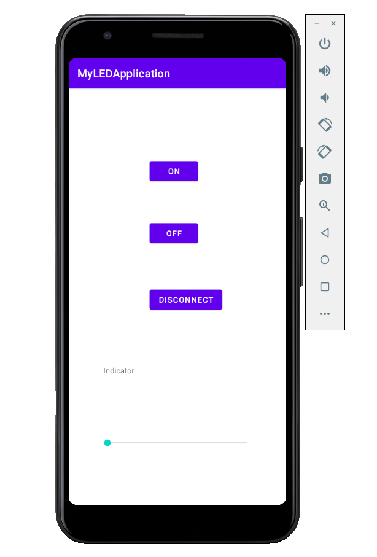
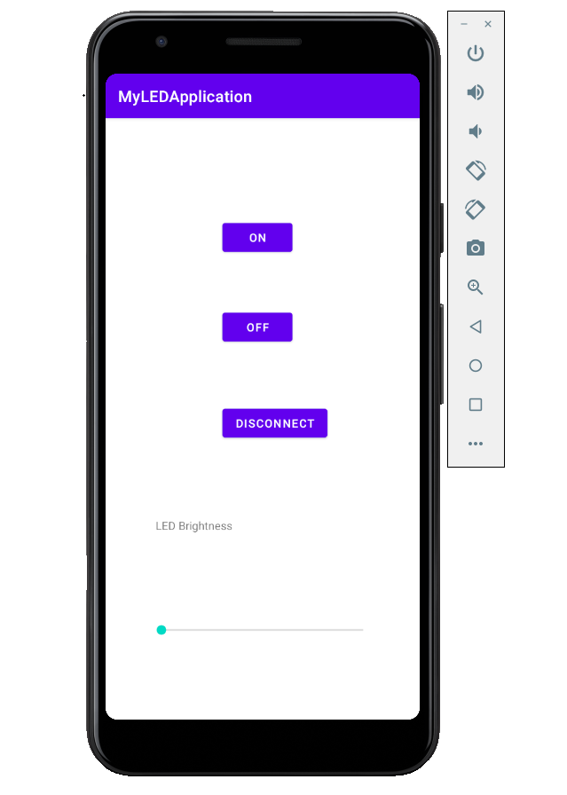

# COEN390

Engineering Product Design Project

# Milestones

# Sprints

# Technology used

# Project Team members

> # Product Owner name: Alexander Vissani
>
>                 student id: 40055566
>                 github username: JustAlexDev
>
> # Team member name: Stirling Smith
>
>                 student id: 40043828
>                 github username:
>
> # Team member name: Benjamin Grant
>
>                 student id: 40059608
>                 github username: Bean-Green
>
> # Team member name: Fatmah Almaas
>
>                 student id: 40013397
>                 github username: Fq899
>
> # Team member name: Yida Li
>
>                 student id: 27033850
>                 github username: yida-li
>
> # Product Scrum Master : Ricky Lopez
>
>                 student id:
>                 github username:

# Documentation

> # Pictures

> > User Interface Prototype

> > > > > [activity_mail.xml](https://github.com/yida-li/COEN390/blob/main/TeamDesignPropType/app/src/main/res/layout/activity_main.xml)

> > > > > 

> > > > > An alternative main UI with a toggle button for the fan

> > > > > 

> > > > > [activity_summary_page.xml](https://github.com/yida-li/COEN390/blob/main/TeamDesignPropType/app/src/main/res/layout/activity_summary_page.xml)

> > > > > 

> > LED connection layout page for Prototype

> > > > > [activity_led_control.xml](https://github.com/yida-li/COEN390/blob/main/TeamDesignLEDApk/app/src/main/res/layout/activity_led_control.xml)

> > > > > 

> > > > > 

> > > > > 

# Edit this page

<a href="https://github.com/yida-li/COEN390/edit/main/README.md" target="_blank"><i class="fa fa-github"></i> Click this link to edit the REAME page as a collaborator/project member</a>
