# COEN390/ELEC390

Engineering Product Design Project

# Milestones

# Technology used

> # Hardware components:

> > : MQ-135 Air Quality Sensor ( MQ )

> > : Arduino Uno R3 USB Microcontroller ( Uno )

> > : Bluetooth Module HC-05 ( Blue )

> > : JQC-3FF 5V Relay ( Relay )

> > : Brushless 24V DC fan ( fan )

> > : Two 9V Batteries

> # Software components:

> > : Arduino IDE 1.8.13

> > : Android Studio

> > : Visual Code Studio

> > : GitHub Desktop

> > : Scrcpy

# Project Team members

> # Product Owner name: Alexander Vissani
>
>                 student id: 40055566
>                 github username: JustAlexDev
>
> # Team member name: Stirling Smith
>
>                 student id: 40043828
>                 github username:
>
> # Team member name: Benjamin Grant
>
>                 student id: 40059608
>                 github username: Bean-Green
>
> # Team member name: Fatmah Almaas
>
>                 student id: 40013397
>                 github username: fatimaAlma
>
> # Team member name: Yida Li
>
>                 student id: 27033850
>                 github username: yida-li
>
> # Product Scrum Master : Ricky Lopez
>
>                 student id:
>                 github username:

# Sprint 1 Prototype

> > > # User Interface Prototype

> > > > > [activity_mail.xml](https://github.com/yida-li/COEN390/blob/master/TeamDesignPropType/app/src/main/res/layout/activity_main.xml)

> > > > > 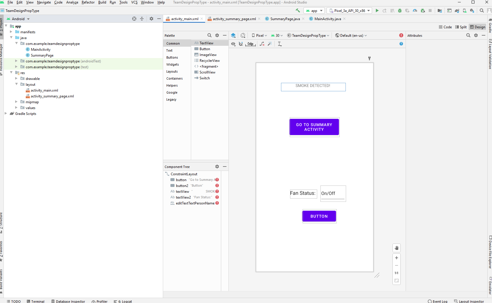

> > > > > An alternative main UI with a toggle button for the fan

> > > > > 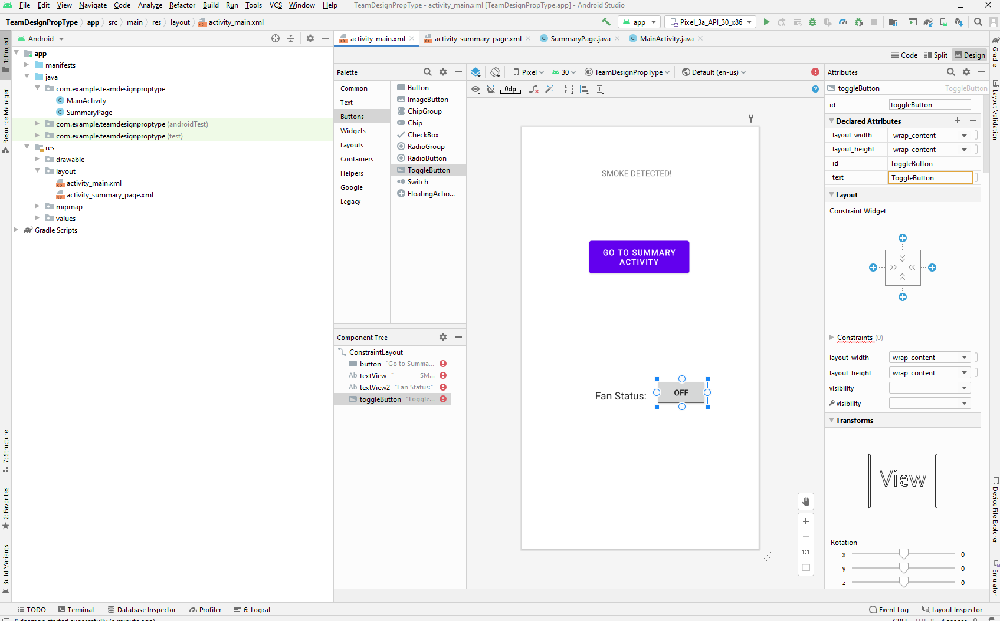

> > > > > [activity_summary_page.xml](https://github.com/yida-li/COEN390/blob/master/TeamDesignPropType/app/src/main/res/layout/activity_summary_page.xml)

> > > > > 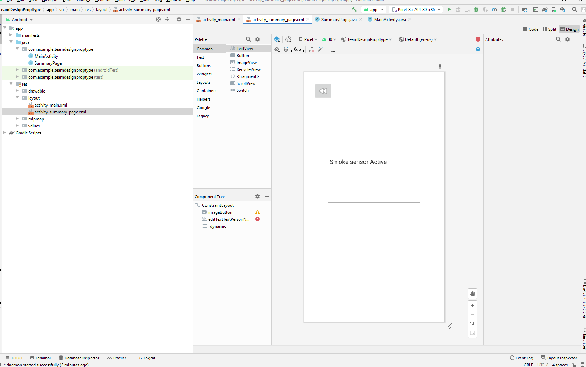

> > > # Fan/Led connection layout page for Prototype

> > > > > [activity_led_control.xml](https://github.com/yida-li/COEN390/blob/master/TeamDesignLEDApk/app/src/main/res/layout/activity_led_control.xml)

> > > > > 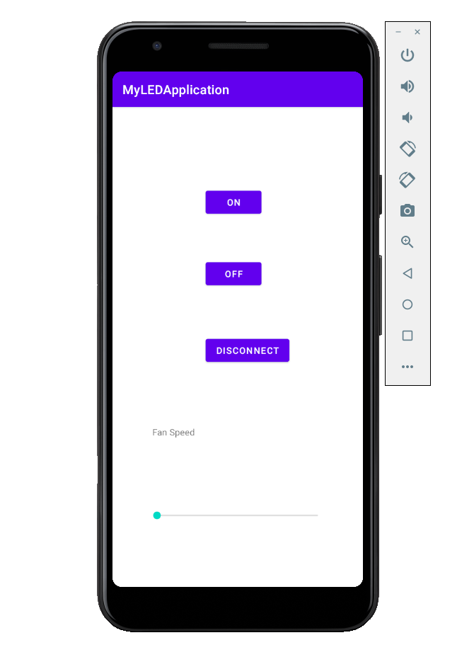

> > > # Blue connection layout page for Prototype

> > > > > [activity_main_screen.xml](https://github.com/yida-li/COEN390/blob/master/TeamDesignBTDatapath/app/src/main/res/layout/activity_main_screen.xml)

> > > > > 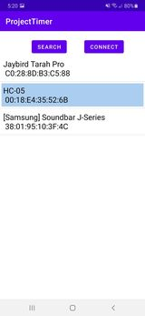

> > > > > [activity_main.xml](https://github.com/yida-li/COEN390/blob/master/TeamDesignBTDatapath/app/src/main/res/layout/activity_main.xml)

> > > > > 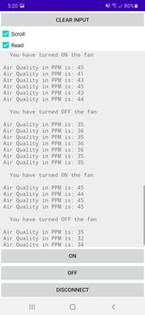

> > > # [App Prototype](https://github.com/yida-li/COEN390/tree/master/TeamDesignApp)

> > > > > [activity_user_activity.xml](https://github.com/yida-li/COEN390/blob/master/TeamDesignApp/app/src/main/res/layout/activity_user_activity.xml)

> > > > > 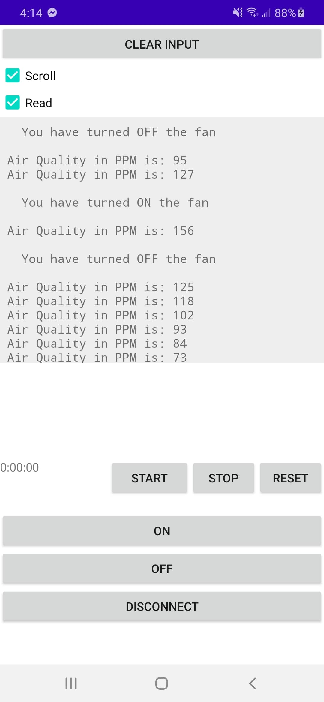

> > > > > 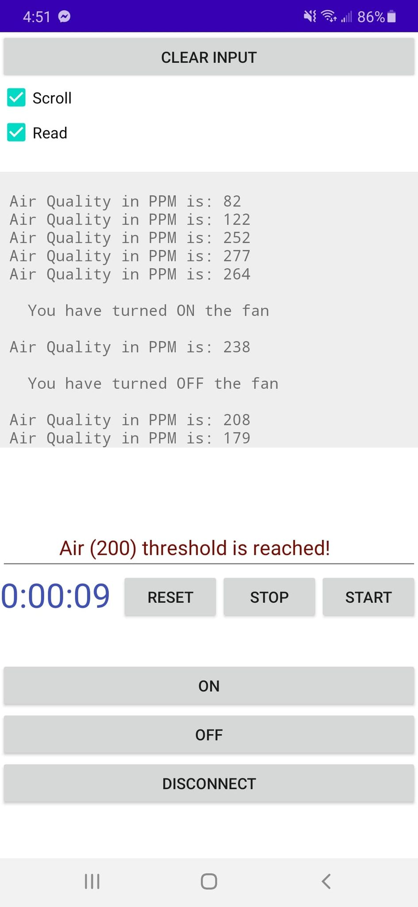

> > > # Protoype wireframe diagram

> > > > > 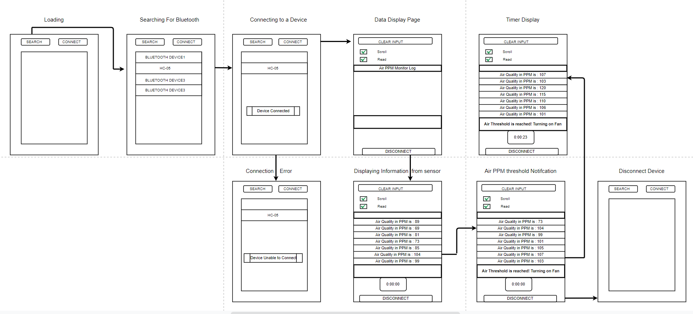

> > > # Protoype System Architecture

> > > > > 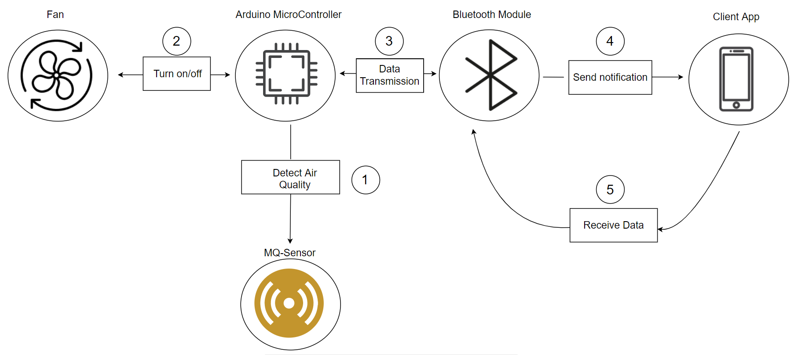

> > ---
> >
> > ---

# Sprint 2 Test Application

> > > # User Interface with automatic/manual settings

> > > > > 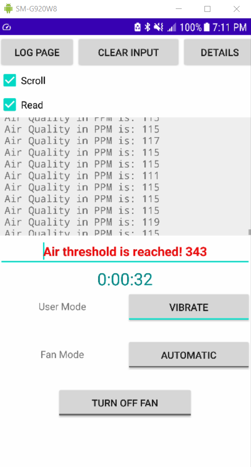

> > > # Notifications Alerts PopUp

> > > > > 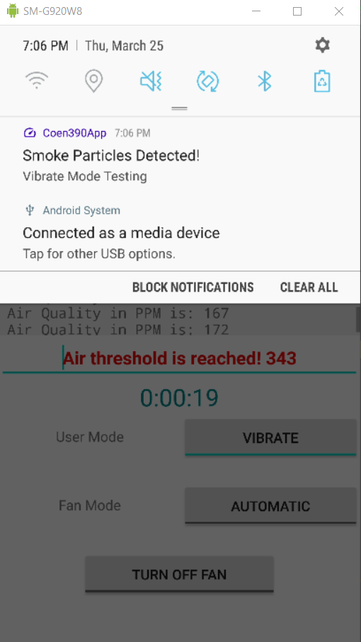

> > > # Notifications Alerts During LockScreen

> > > > > 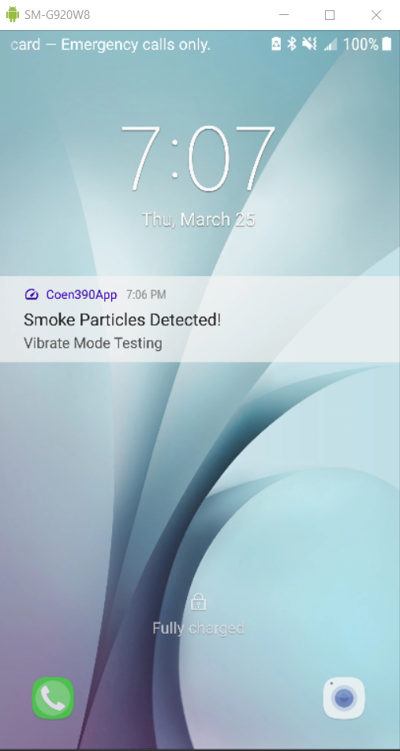

> > > # Addtional Page recording/displaying data

> > > > > 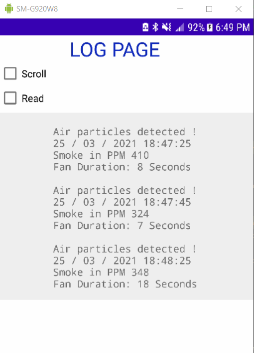

> > > # Updated wireframe diagram

> > > > > 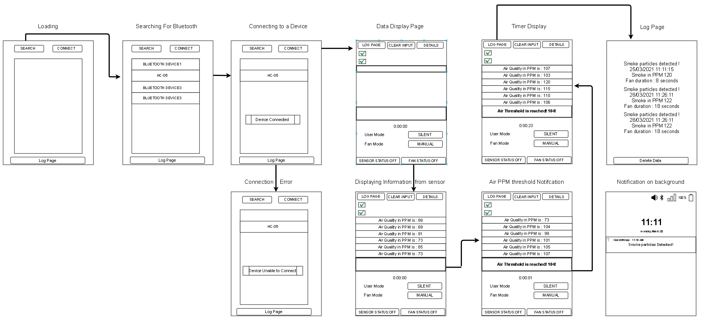

# Sprint 3 Main Application

> > > # Updated wireframe diagram

> > > > > 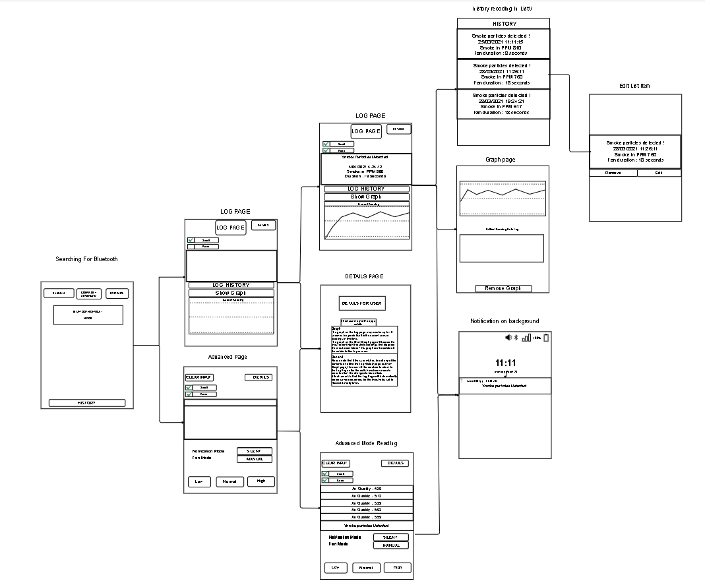

> > > # Updated System Architecture

> > > > > 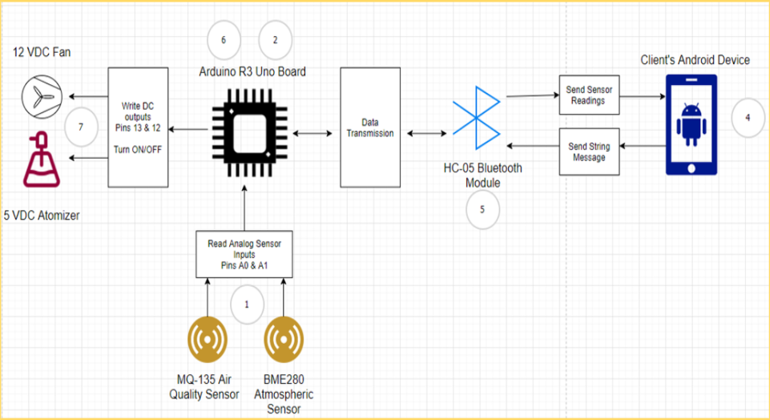

> > ---
> >
> > ---

# Edit this page

<a href="https://github.com/yida-li/COEN390/edit/master/README.md" target="_blank"><i class="fa fa-github"></i> Click this link to edit the REAME page as a collaborator/project member</a>
